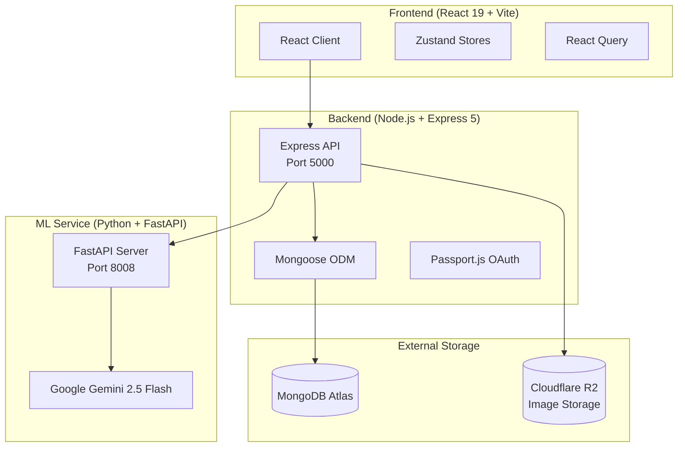
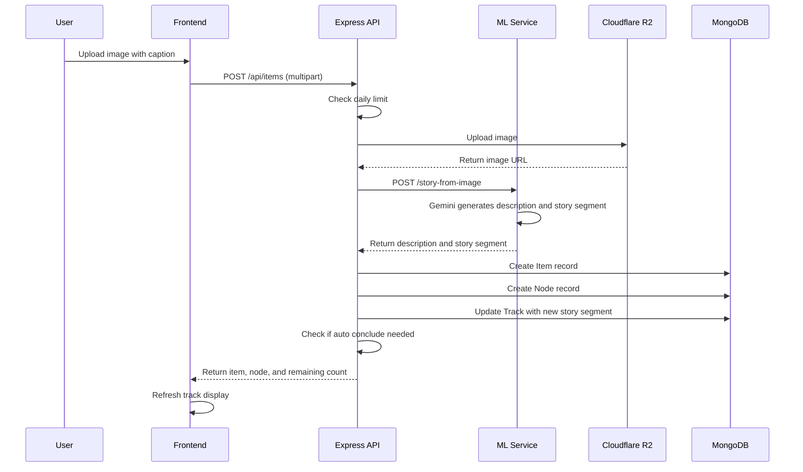
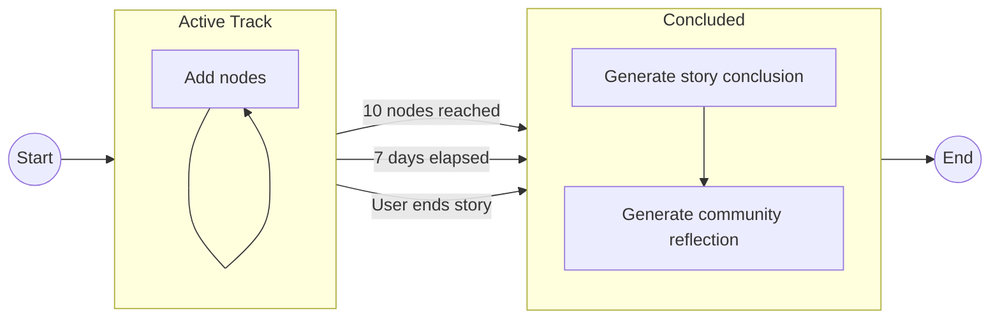
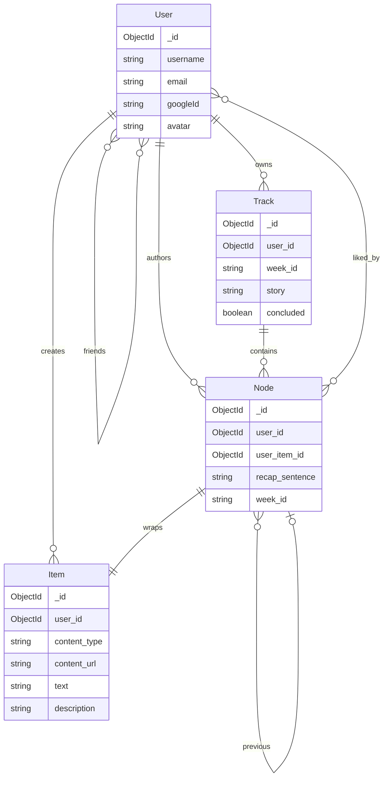

&nbsp;&nbsp;&nbsp;&nbsp;&nbsp;


**SPARKHACKS 2026**

# PROJECT: MORYTALE

*where random moments strike into untold narrative masterpieces...*

**Track 02: Narrative storytelling in an interactive application**

> Morytale transforms weekly digital moments into a living narrative using generative AI, helping users discover the story hidden inside their everyday life.

## Table of Contents

1. [Team](#team)
2. [Problem](#problem)
3. [Solution](#solution)
4. [Key Features](#key-features)
5. [Architecture](#architecture)
6. [Tech Stack](#tech-stack)
7. [Project Structure](#project-structure)
8. [API Reference](#api-reference)
9. [Getting Started](#getting-started)
10. [Deployment](#deployment)
11. [Demo Screenshots](#demo-screenshots)
12. [Challenges](#challenges)
13. [Innovation](#innovation)
14. [Impact](#impact)
15. [What We Learned](#what-we-learned)
16. [Future Improvements](#future-improvements)

## Team

| Name | Email | Github |
|------|-------|-------|
| Viet Thai Nguyen | vnguy87@uic.edu | [@AlgoriThai07](https://github.com/AlgoriThai07) |
| Han Dang | ldang7@uic.edu | [@ghandle18](https://github.com/ghandle18) |  
| Minh Khoa Cao | mcao@uic.edu | [@cmkhoa](https://github.com/cmkhoa) |
| Hoang Minh Ngo | mngo@uic.edu | [@hoangngo-sudo](https://github.com/hoangngo-sudo) |

## Problem

Modern social platforms are great at documenting events, but they rarely interpret the patterns behind them. Users post isolated content like photos, short text, and captions every day, but the platforms never answer the deeper questions. What themes defined your week? Did your mood shift over time? How does your experience compare to what others are going through?

We wanted to build a system that takes these small, scattered moments and transforms them into structured narrative reflection. Instead of just storing memories, we wanted to help people understand the story their life is telling.

## Solution

Morytale introduces the concept of Weekly Tracks. Rather than scrolling through a traditional feed, users build a connected chain of posts called a Track throughout their week.

Each post creates what we call a Node. A Node contains one photo or one text entry, along with an optional caption. When you upload something, our AI generates a story segment that weaves that moment into the week's ongoing narrative.

At the end of each week, the system generates two things. First, it creates a Personal Story, which is a warm, reflective conclusion that wraps up the week's experiences. Second, it generates a Community Reflection, which shares anonymous parallels from other users' weeks to show that you are not alone in what you are going through.

The result is an interactive narrative shaped by real user behavior, turning everyday moments into meaningful stories.

## Key Features

### Intentional Posting Design

We designed Morytale with constraints that improve the storytelling experience. Users can make up to 30 posts per day during the demo, but in regular use we stick with only 10 posts per day. There is also a 20 friend cap and a weekly reset cycle. These limitations improve narrative pacing and reduce the content overload that plagues most social platforms.

### AI Story Weaving

Every time you upload an image or text, it gets sent to a Gemini 2.5 Flash model. The AI describes what was shared, writes the next one or two sentences of your weekly story, and maintains narrative continuity with all your previous moments. Each upload builds on the last, creating a cohesive story rather than isolated posts.

### Track Conclusion and Community Reflection

When you finish your weekly track, either by reaching the node limit or by manually ending your story, the system kicks into action. It generates a warm conclusion that wraps up the week's narrative. Then it finds similar stories from the community and creates a reflection that shows you the connections between your experience and others. This helps users feel less alone in their experiences.

### Social Layer

Morytale includes a full social experience. You can sign in with Google OAuth, send and accept friend requests, and remove friends when needed. You can like nodes from other users and receive real time notifications about those interactions. There is an explore page where you can discover community tracks, and user profiles let you browse track history.

### Notifications

The notification system keeps you connected. You will receive alerts when someone likes your content, when you get a friend request, and when someone accepts your request. Updates arrive through a polling based system that keeps things running smoothly.

## Architecture

The application uses a three tier architecture that separates concerns cleanly. The React client handles the user interface, the Express API manages all the business logic, and a Python ML service handles AI generation tasks.



The Express API handles all orchestration, including item storage, node and track management, daily limits, and auto conclude logic. The Python ML service is a stateless worker that only performs AI generation tasks. This separation makes the system easier to scale and maintain.

### Item Upload Flow

When a user uploads content, the system processes it through several steps. This diagram shows how data flows from the user through all the services.



### Track Lifecycle

Each track follows a natural lifecycle from creation to conclusion. A new track starts when a user makes their first post of the week. The track stays active as new nodes get added. When certain conditions are met, like reaching 10 nodes or passing 7 days, the system automatically concludes the track with AI generated content.



### Data Model Relationships

The core data models connect to form the foundation of the narrative system. Users own tracks and create items. Nodes wrap items and form a linked list structure within tracks.



## Tech Stack

### Frontend

The frontend is built with React 19 as the UI framework, using Vite as the build tool and development server. TypeScript provides type safety throughout the codebase. React Router 7 handles client side routing, while Zustand manages application state. React Query from TanStack handles server state and caching. Bootstrap 5 provides styling, Animate.css adds animations, and Axios serves as the HTTP client.

### Backend

The backend runs on Node.js with Express 5 as the REST API server. MongoDB serves as the database with Mongoose as the ODM. Passport.js handles Google OAuth 2.0 authentication, and JWT manages session tokens. Multer processes file uploads, and Cloudflare R2 (which is S3 compatible) stores images.

### ML Service

The ML service is built with Python and FastAPI as the microservice framework. Google Gemini 2.5 Flash powers all story generation for both text and vision tasks. Pillow handles image processing, and Uvicorn serves as the ASGI server.

## Project Structure

```
morytale/
├── frontend/                   # React client
│   ├── src/
│   │   ├── components/         # Reusable UI components
│   │   │   ├── AuthGuard/      # Route protection
│   │   │   ├── DailyUpdateToast/
│   │   │   ├── Header/
│   │   │   ├── Marquee/
│   │   │   ├── SignInModal/
│   │   │   └── UploadModal/
│   │   ├── pages/              # Route pages
│   │   │   ├── LandingPage       # Public landing
│   │   │   ├── StoryPage         # Current week story builder
│   │   │   ├── StoryRecapPage    # Weekly recap view
│   │   │   ├── FinishTrackPage   # Conclude track flow
│   │   │   ├── MyTracksPage      # Track history
│   │   │   ├── MonthlyShowcasePage
│   │   │   ├── ViewTrackPage     # Single track detail
│   │   │   ├── ExplorePage       # Community tracks
│   │   │   ├── ProfilePage       # User profile
│   │   │   └── FriendsPage       # Friend management
│   │   ├── services/api.ts     # Axios API client
│   │   ├── store/              # Zustand stores
│   │   │   ├── authStore.ts
│   │   │   ├── trackStore.ts
│   │   │   ├── socialStore.ts
│   │   │   └── notificationStore.ts
│   │   ├── types/index.ts      # TypeScript interfaces
│   │   └── styles/
│   └── vite.config.ts
├── server/                     # Express API
│   ├── index.js                # Entry point
│   ├── config/
│   │   ├── db.js               # MongoDB connection
│   │   └── passport.js         # Google OAuth strategy
│   ├── middleware/
│   │   └── authMiddleware.js   # JWT verification
│   ├── models/                 # Mongoose schemas
│   │   ├── User.js
│   │   ├── Item.js             # Content (image/text + embedding)
│   │   ├── Node.js             # Story node in a track
│   │   ├── Track.js            # Weekly track
│   │   └── Notification.js
│   ├── controllers/            # Route handlers
│   ├── routes/                 # Express routes
│   └── services/
│       ├── modelApi.js         # ML service client
│       ├── r2Storage.js        # Cloudflare R2 uploads
│       └── ml/                 # Python ML microservice
│           ├── server.py       # FastAPI app
│           ├── storyGeneration.py
│           ├── trackConclusion.py
│           └── requirements.txt
└── Dockerfile                  # Multi-stage production build
```

## API Reference

### Auth Endpoints (/api/auth)

| Method | Endpoint | Description |
|--------|----------|-------------|
| POST | /register | Register with email and password |
| POST | /login | Login with email and password |
| GET | /me | Get current user (requires authentication) |
| GET | /google | Initiate Google OAuth |
| GET | /google/callback | OAuth callback handler |

### Items Endpoints (/api/items)

All endpoints require authentication.

| Method | Endpoint | Description |
|--------|----------|-------------|
| POST | / | Create item with image upload or text |
| GET | /:id | Get single item |
| GET | /user/:userId | Get items by user |
| PUT | /:id | Update item |
| DELETE | /:id | Delete item |

### Nodes Endpoints (/api/nodes)

All endpoints require authentication.

| Method | Endpoint | Description |
|--------|----------|-------------|
| POST | / | Create node (triggers AI story generation) |
| GET | /:id | Get single node |
| GET | /user/:userId | Get nodes by user |
| PUT | /:id | Update node |
| DELETE | /:id | Delete node |
| POST | /:id/like | Like a node |
| DELETE | /:id/like | Unlike a node |

### Tracks Endpoints (/api/tracks)

All endpoints require authentication.

| Method | Endpoint | Description |
|--------|----------|-------------|
| GET | /current | Get current week track |
| GET | /history | Get past tracks |
| GET | /community | Get community tracks |
| GET | /:id | Get single track |
| GET | /:id/story | Get compiled story for track |
| POST | /:id/conclude | Conclude track (triggers AI conclusion) |
| PUT | /:id | Update track |
| DELETE | /:id | Delete track |

### Users Endpoints (/api/users)

All endpoints require authentication.

| Method | Endpoint | Description |
|--------|----------|-------------|
| GET | /me | Get own profile |
| PUT | /me | Update profile |
| GET | /friends | Get friend list |
| GET | /search | Search user by email |
| GET | /requests | Get pending friend requests |
| POST | /requests/:id/accept | Accept friend request |
| DELETE | /requests/:id | Reject friend request |
| GET | /:id | Get user profile |
| POST | /:id/request | Send friend request |
| DELETE | /:id/friend | Remove friend |

### Notifications Endpoints (/api/notifications)

All endpoints require authentication.

| Method | Endpoint | Description |
|--------|----------|-------------|
| GET | / | Get notifications |
| PUT | /read-all | Mark all as read |
| PUT | /:id/read | Mark one as read |
| DELETE | /:id | Delete notification |

### ML Service Endpoints (Port 8008)

| Method | Endpoint | Description |
|--------|----------|-------------|
| POST | /api/ml/story-from-image | Generate story segment from image |
| POST | /api/ml/story-from-text | Generate story segment from text |
| POST | /api/ml/generate-conclusion | Generate track conclusion and community reflection |
| GET | /api/ml/health | Health check |

## Getting Started

### Prerequisites

Before running Morytale, you will need Node.js 20 or higher, Python 3.10 or higher, and a MongoDB Atlas account (or a local MongoDB installation). You will also need a Cloudflare R2 bucket for image storage, Google Cloud OAuth credentials for authentication, and a Google Gemini API key for AI generation.

### Environment Variables

Create a `.env` file in the `server/` directory with the following variables:

```env
MONGODB_URI=mongodb+srv://...
JWT_SECRET=your_jwt_secret

GOOGLE_CLIENT_ID=your_google_client_id
GOOGLE_CLIENT_SECRET=your_google_client_secret
GOOGLE_GEMINI_API=your_gemini_api_key

R2_ACCOUNT_ID=your_r2_account_id
R2_ACCESS_KEY_ID=your_r2_access_key
R2_SECRET_ACCESS_KEY=your_r2_secret_key
R2_BUCKET_NAME=morytale
R2_PUBLIC_URL=https://pub-xxx.r2.dev

MODEL_API_URL=http://localhost:8008
```

### Run Locally

**Step 1: Start the Backend (Express API)**

```bash
cd server
npm install
npm run dev
```

**Step 2: Start the Frontend (React + Vite)**

```bash
cd frontend
npm install
npm run dev
```

**Step 3: Start the ML Service (FastAPI)**

```bash
cd server/services/ml
python -m venv venv

# On Windows
.\venv\Scripts\Activate.ps1
# On macOS or Linux
source venv/bin/activate

pip install -r requirements.txt
python server.py
```

Once everything is running, the frontend will be available at http://localhost:5173, the Express API at http://localhost:5000, and the ML service at http://localhost:8008.

## Deployment

### Docker (Production)

The included multi-stage Dockerfile builds the frontend and bundles it with the Express server. To build and run the container:

```bash
docker build -t morytale .
docker run -p 5000:5000 --env-file server/.env morytale
```

Note that the ML service runs separately and must be deployed alongside the main application. Configure its location using the MODEL_API_URL environment variable.

## Demo Screenshots

<details>
       <summary><strong>Click to open demo screenshots</strong></summary>
       
       <details>
              
       </details>
       <details>
              
       </details>
       <details>
              
       </details>
       <details>
              
       </details>
       <details>
              
       </details>
       <details>
              
       </details>
       <details>
              
       </details>
       <details>
       
       </details>
       <details>
              
       </details>
       <details>
              
       </details>
       <details>
              
       </details>
       <details>
              
       </details>
       <details>
              
       </details>
       <details>
              
       </details>
       <details>
              
       </details>
</details>

## Operation Logic

<br>

[@Figma Link](https://www.figma.com/board/cSuav0RHsDQbNt26FuRQ0H/SH26---The-Cutting-Room-Ideation-Board?node-id=0-1&t=8osmz0hyamvbW3RM-1)

## Challenges

Building Morytale during a hackathon presented several challenges. We had to balance our ambitious AI goals with the reality of limited time. Designing a clean separation between the Node.js orchestration layer and the stateless Python ML worker required careful planning. Getting Gemini 2.5 Flash to produce consistent, well-structured JSON for story segments took some iteration to get right. Coordinating the frontend, backend, and ML service across three processes during development added complexity to our workflow. Finally, building a full social layer with friends, likes, and notifications alongside the core narrative engine was a significant undertaking.

Throughout all of these challenges, we prioritized stable end-to-end functionality over experimental features.

## Innovation

Morytale differs from traditional journaling apps and social feeds in several important ways. First, it generates stories incrementally, meaning each upload extends a running narrative rather than creating a standalone post. Second, it uses multimodal AI through Gemini 2.5 Flash, which processes both images and text to weave story segments together. Third, it connects personal experience with community by showing anonymous parallel stories that help users know they are not alone. Fourth, it applies intentional design constraints, using daily limits and friend caps to shape more meaningful interaction.

We are not just summarizing posts. We are building narratives from the accumulation of small moments over time.

## Impact

This project explores several interesting areas including reflective digital storytelling, AI-assisted behavioral insight, reduced-performance social interaction, and intentional posting design.

There are many potential use cases for this approach. Students could use it as a reflection tool to track their academic journey. Writers and creatives could use it as a journaling platform. Mental health professionals could adapt it for pattern awareness applications. Anyone interested in weekly behavioral insight tracking could benefit from this kind of narrative approach.

## What We Learned

### Technical Lessons

We discovered that narrative can emerge from iterative AI generation over a sequence of user inputs. Separating ML into a stateless microservice greatly simplified the main API server and made the architecture cleaner. We also found that Zustand combined with React Query is an effective lightweight state management combination for React 19 applications.

### Interpersonal Lessons

Throughout this experience, each team member learned to adapt and improvise under limited time and resources in a hackathon context. We collaborated effectively by maximizing each person's strengths toward our shared goal.

## Future Improvements

Looking ahead, we have several ideas for extending Morytale. We would like to add monthly and semester level narrative arcs that span longer time periods. Mood trajectory visualization would help users see emotional patterns over time. Embedding based similarity matching would create richer community connections. More advanced clustering algorithms with hierarchical or dynamic K values could improve story matching. Finally, personalized long term trend detection would give users deeper insights into their patterns over extended periods.

---
